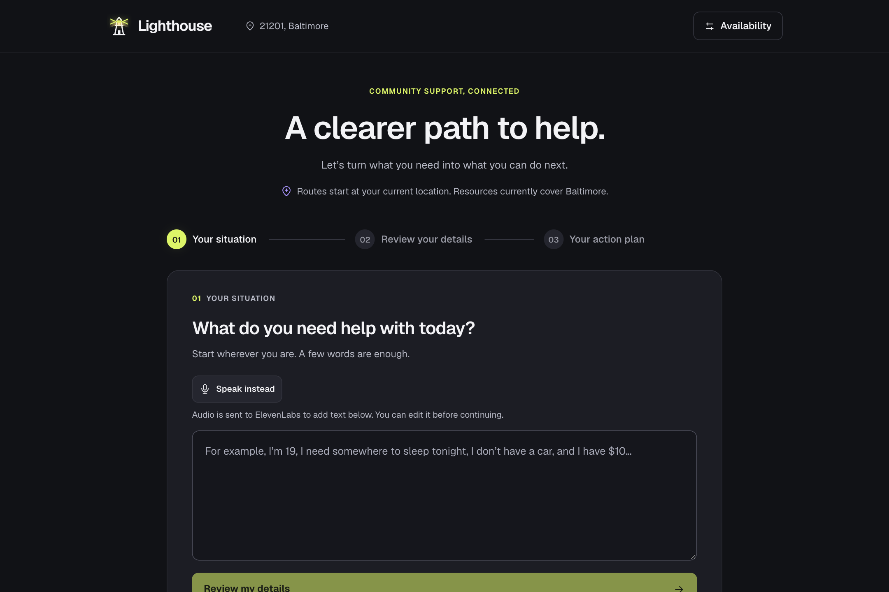
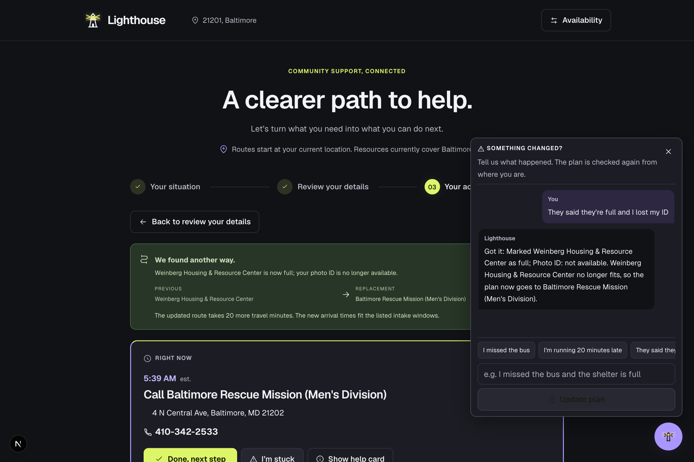
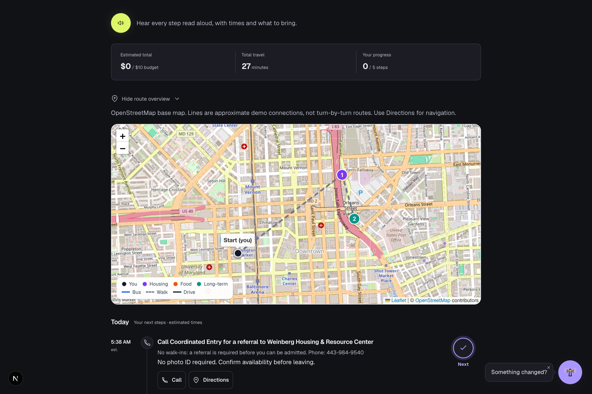
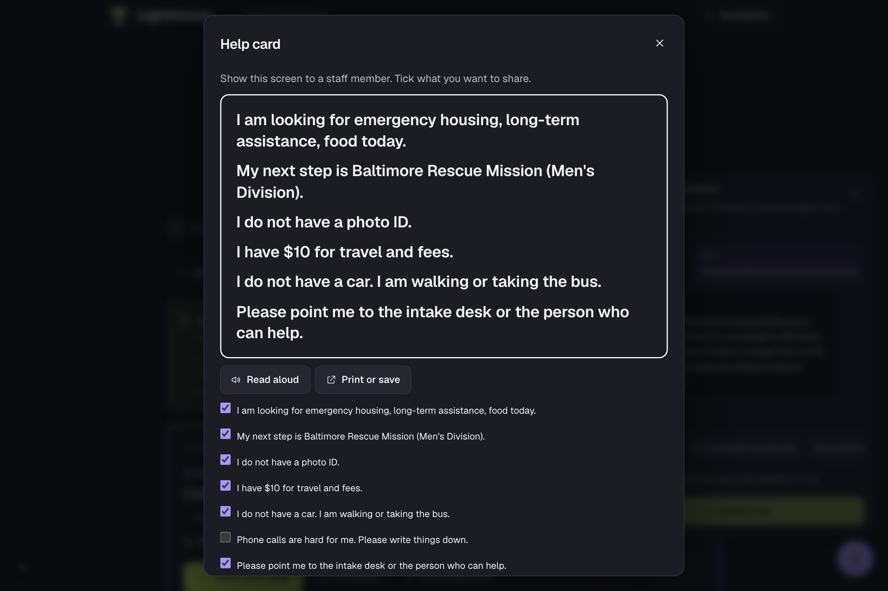
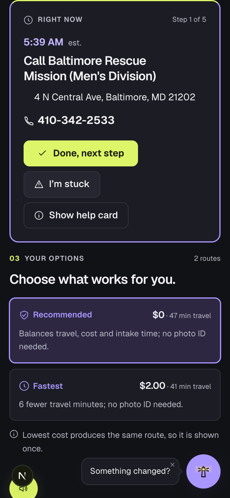

# Lighthouse - Step-by-Step Guide to Community Help

Lighthouse turns "I have $10, no car, and nowhere to sleep tonight" into a step-by-step route to real shelters and services, and replans on the spot when a bed fills up or you miss the bus.

Built at HopHacks 2026.



## Features

### Natural-Language Input
- **Describe your situation in your own words**: typed or spoken, one sentence is enough
- **Voice input**: dictate with the microphone button (ElevenLabs Scribe)
- **Structured extraction**: needs (shelter, food, longer-term help), age, budget, ID, household, transport
- **Review before planning**: every extracted detail is editable, nothing is assumed silently
- **Offline fallback**: a rule-based parser handles the same phrases when the AI is unavailable

### Real Plans, Not Lists
- **Verified data**: 12 real Baltimore organizations with hours, intake cutoffs, rules and source links
- **Eligibility and status checks**: age, photo ID, household, pets, accessibility, capacity, full/closed
- **Time-aware routing**: arrival time is checked against opening hours and intake deadlines for every stop
- **Walking, bus and transfers**: seeded CityLink routes, fares by household size, long walks flagged
- **Three strategies**: Recommended, Fastest, Lowest cost, with identical routes collapsed
- **Explained rejections**: every place that was not chosen shows the exact reason

### Follow It One Step at a Time
- **Right Now card**: the single next action with address, phone, intake cutoff and what to bring
- **Milestones**: a large check beside every step; progress is tracked
- **Listen to this plan**: every step read aloud with times (ElevenLabs)
- **Help card**: your situation in large print to show a staff member, with read-aloud and print

### Replan When Life Happens
- **Something changed?**: "I missed the bus", "they said they're full", "I lost my ID", "I'm at Mount Vernon now"
- **Progress-aware**: replans from where you are, what time it is and what you've already finished
- **Availability and delays**: simulate a shelter filling up or a bus route running late
- **Blocked-need diagnosis**: when nothing fits, it names the cause and what would unblock it

| Replanned after "they said they're full and I lost my ID" | Route overview and progress |
|---|---|
|  |  |

| Help card for staff | On a phone |
|---|---|
|  |  |

## Architecture

### Frontend (Next.js)
- **Next.js 16 / React 19**: single-page journey from input to review to plan to replanning
- **Leaflet + OpenStreetMap**: route overview with markers and polylines, no API key
- **Geolocation**: routes start from the person's real position or a searched address
- **Accessible dialogs**: keyboard operation, focus containment, large-print help card, print stylesheet

### Backend (FastAPI)
- **FastAPI + Pydantic**: typed API, every request and response validated
- **Planner (pure Python + NetworkX)**: filters, travel graph, exhaustive time-window search, scoring, timeline
- **Disruption agent**: Gemini function calling over six state-changing tools, with a regex fallback
- **Voice**: ElevenLabs text-to-speech and speech-to-text
- **Data**: JSON files loaded into memory; no database
- **Tests**: 155 backend tests and frontend journey tests, all runnable with the language model disabled

### AI Boundaries
- **Google Gemini**: structured output for extraction, function calling for "something changed"
- **The model never picks a place or writes a route**: it only produces inputs to the planner
- **Model fallback chain**: `gemini-3.1-flash-lite` → `gemini-3.6-flash` → `gemini-3.7-flash` on rate limits
- **Fully functional without a key**: rule-based parsing keeps the demo running

## Quick Start

### Prerequisites
- Node.js 20+
- Python 3.11+
- [uv](https://docs.astral.sh/uv/)
- Gemini API key (optional)
- ElevenLabs API key (optional, for voice)

### Installation

**Clone the repository**

```bash
git clone https://github.com/anooz0627/hophacks_f26.git
cd hophacks_f26
```

**Configure environment variables**

```bash
cp backend/.env.example backend/.env
# Edit backend/.env and add GEMINI_API_KEY and ELEVENLABS_API_KEY
```

**Start both servers**

```bash
./dev.sh
```

The backend starts at http://localhost:8000 and the app at http://localhost:3000. Dependencies are installed on the first run.

**Or run them separately**

```bash
cd backend
uv venv .venv
uv pip install -e '.[dev]'
.venv/bin/uvicorn app.main:app --reload --port 8000
```

```bash
cd frontend
npm ci
npm run dev
```

### Tests

```bash
cd backend && .venv/bin/python -m pytest -q
cd frontend && npm test
```

## Usage

### Describe Your Situation

| Input | What Lighthouse does |
|---|---|
| "I'm 19. I lost my housing today, don't have a car, have $10, and need somewhere to sleep tonight." | Shelter + food tonight, longer-term help this week, budget $10, no car |
| "Me and my two kids got evicted this morning. I have my ID and $25 but no car." | Household of 3 with children, ID confirmed, family shelters only |
| "I'm 22, in Mount Vernon. I need food tonight, have no money, and can only walk." | Food only, budget $0, walking routes only, start from Mount Vernon |

### Something Changed?

| Message | Effect |
|---|---|
| "I missed the bus" | Start time moves 15 minutes; every later step is rechecked |
| "I'm running 20 minutes late" | Start time moves 20 minutes |
| "They said they're full" | The shelter in your plan is marked full and replaced |
| "The bus is delayed 15 minutes" | Waiting time on that route grows; a faster option may win |
| "I lost my ID" | Places that require ID drop out |
| "I'm at Mount Vernon now" | The route restarts from Mount Vernon |
| "I already ate" | The meal step is marked done and dropped from the plan |
| "That's too far to walk" | Walking limit drops to 3 km and the plan is recomputed |

### Demo Panel
- **Availability**: mark any place available, full, closed, delayed or unavailable
- **Bus delays**: add 5 to 45 minutes to any route
- **Reset demo availability**: restore everything
